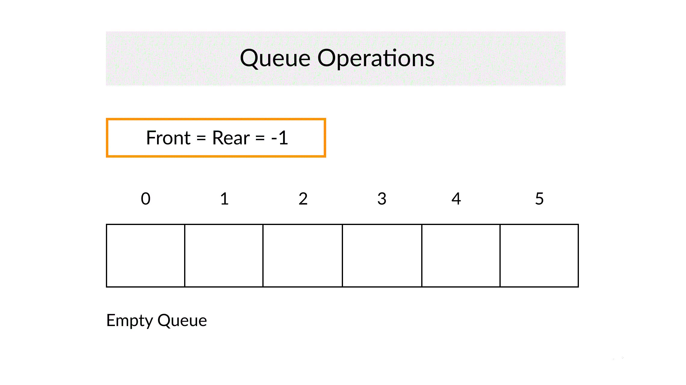

# Queue

**Queue** is a linear structure which follows a particular order in which the operations are performed. The order is First In First Out (FIFO).  A good example of queue is INDIAN RAILWAY STATION Counter where all the passengers are stand in a line of ticket counter. First person name RAHUL came for some station ticket and after that passengers continously in the line. So this is a example of queue because First person RAHUL came so he will get ticket first then all from RAHUL. So there is a approach here **FIRST IN FIRST OUT**

The difference between stacks and queues is in removing. In a stack we remove the item the most recently added; in a queue, we remove the item the least recently added.

## Operations on Queue:

Important operation on Queue is : 
* Enqueue
* Dequeue
* Front
* Rear
* Peek(pos)
* isEmpty( )
* isFull( )

#### EnQueue :

We all know when talking about a Queue is just a Railway Station Ticket counter line where first person came and then he will get first ticket then after other. It is just like a First Come First Server Approach. So other person must be insert in the line from the end only. Exactly in Queue we can only insert element from End of Queue only. When we do inertion operation in Queue at end then it is called EnQueue Operation.
* **Note :** First check Queue is full or not means if it have space then insertion will be possible and Element given.

#### DeQueue :

As Enqueue is inserting at the end of the Queue then Dequeue is Deleting from Start of the Queue. Example :- Through the Previous example Railway Station Conter line we all know when first person named Rahul came then obiviously he will get the ticket first so that he will get ticket then he will be removed exactly the same procedure here. First Element will come then it will removed first and this approach here is First Come First Out.
* **Note :** First check Queue is empty or not means if it have space then deletion will be possible.

#### Front :

This operation is not an important operation here but it is an operation and we are going to implement it too here. **Front** By the name this opeartion will return Front element of the queue. Like in Linked List we implement StackTop operation ( function ) same here this operation will return front or top element of the queue.
* **Note :** When we implement Dequeue Operation( Deletion ) then front will change (Rememeber).  

#### Rear :

This is also an basic operation here. Front means front or top of the Queue and Rear means the last or End of the Queue. It is same as Front Opeartion ( return Front element ).
This return last element of the Queue.
* **Note :** When we implement Enqueue Operation ( Insertion ) then Rear will change (Remember).

#### Peek :

We discussed about Peek Operation in **Stack** implementation as it return any element of the Stack ( given position ). Same here it will return any element of the Queue by giving the position of the Queue.
* **Note :** Position Given 

#### isEmpty() :

isEmpty is an operation which tells us that a given data structure is empty or not. In this  case also it will return our Queue is Empty or not.
* **Note :** If empty return 1 if not return 0.

#### isFull() :

isEmpty is an operation which tells us that a given data structure is full or not. In this  case also it will return our Queue is full or not.
* **Note :** If full return 1 if not return 0.

There are lot of differences and similiarities between Queues and other data structure.

### Difference between Stacks and Queue :

1. * Stacks are based on the LIFO principle, i.e., the element inserted at the last, is the first element to come out of the list
   * Queues are based on the FIFO principle, i.e., the element inserted at the first, is the first element to come out of the list.

2. * Insertion and deletion in stacks takes place only from one end of the list called the top.
   * Insertion and deletion in queues takes place from the opposite ends of the list. The insertion takes place at the rear of the list and the deletion takes place from the          front of the list.

3. * Insert operation is called push operation.
   * Insert operation is called enqueue operation.

4. * Delete operation is called pop operation.
   * Delete operation is called dequeue operation.

5. * In stacks we maintain only one pointer to access the list, called the top, which always points to the last element present in the list. 
   * In queues we maintain two pointers to access the list. The front pointer always points to the first element inserted in the list and is still present, and the rear pointer      always points to the last inserted element.

6. * Stack is used in solving problems works on recursion
   * Queue is used in solving problems having sequential processing.
   
   
### Simliarity Between Queue and Stack : 

1. The Stack and Queue both are the Non-primitive data structures.

2. Stack and queue is linear data structures they both stores sequentially.

3. Insertion and Deletion operation can be performed on Stack as well as in queue.
