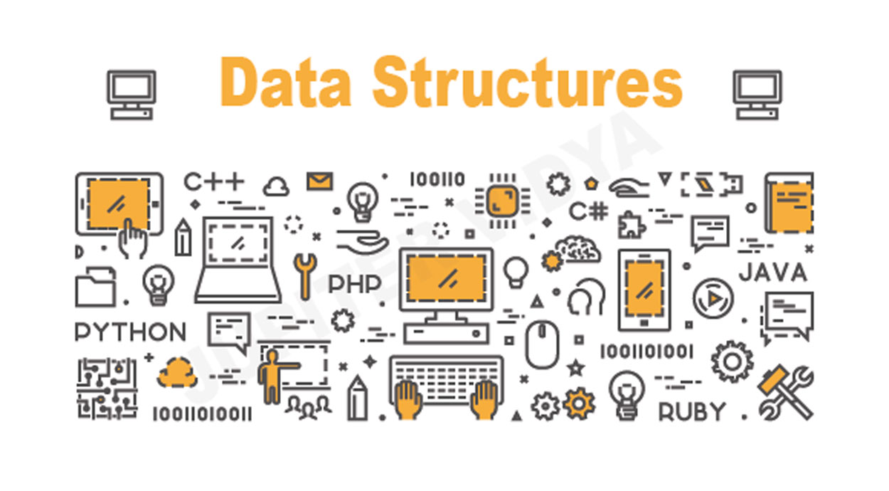

# Data Structure and Algorithms
According to the view of Placement, we all know Data Structure and Algorithms is very mandatory thing nowadays. So I will cover these topics. Actually I am also still learning Data Structure and Algorithms from [GeeksForGeeks](https://www.geeksforgeeks.org/). Here is learning, practice and placements type problems. So let's get started :

This repository conatins algorithms of **Data Structure** :

* Array
* String
* Linked List
* Tree
* Stack
* Queue
* many more

I am doing these in C++. But if you know JAVA you can but one drawback is that in Java no pointers it have so, I choose C++ and if you know C language then **Great**. We can do this.
