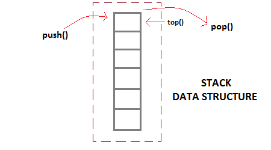
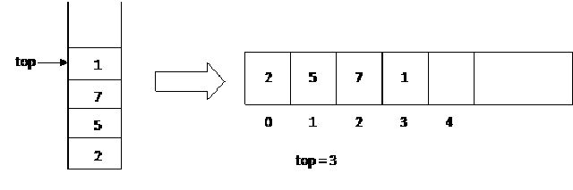

## Stack :

Stack is a linear data structure. Operations on Stack are performed in **LIFO** ( Last in First Out ) order.

**Application of Stack :**
* Function Calls
* Infix to Postfix and vice versa
* Paranthesis Matching and amny more.

## Stack as Abstract Data Type :

In order to make a stack we need a pointer to the top most element along with the other elements which are stored inside the stack.

**Operations :**
1. Push() - Push or insert an element to an stack
2. Pop() - Remove element from stack but always when we said pop an element from stack it is the top most element of stack. 
3. Peak() - Value at given index or position ( it is specified ).
4. isEmpty() or isFull() - Determine the stack is full or empty. Empty means top = -1.

**Implementation :**

Stack is a collection of elements with certain operations following LIFO order. A stack can be implemented by Array and Linked List.

## Implementing Stack Using Array :

As, Stack is collection of items but stored elements in LIFO order. Items can be inserted or removed from only one end i.e TOP. 

If Stack is empty then TOP = -1 But in this TOP = 3 that means there are four elements.
