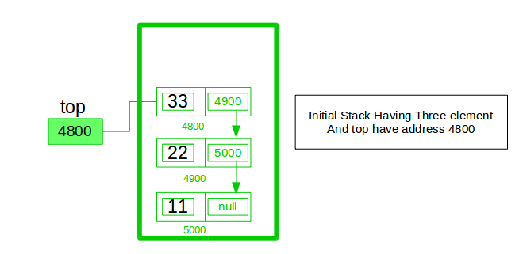

## Stack :

Stack is a linear data structure. Operations on Stack are performed in **LIFO** ( Last in First Out ) order.

**Application of Stack :**
* Function Calls
* Infix to Postfix and vice versa
* Paranthesis Matching and amny more.

## Stack as Abstract Data Type :

In order to make a stack we need a pointer to the top most element along with the other elements which are stored inside the stack.

**Operations :**
1. Push() - Push or insert an element to an stack
2. Pop() - Remove element from stack but always when we said pop an element from stack it is the top most element of stack. 
3. Peak() - Value at given index or position ( it is specified ).
4. isEmpty() or isFull() - Determine the stack is full or empty. Empty means top = -1.

**Implementation :**

Stack is a collection of elements with certain operations following LIFO order. A stack can be implemented by Array and Linked List.

## Implementing Stack Using Array :

As, Stack is collection of items but stored elements in LIFO order. Items can be inserted or removed from only one end i.e TOP. 

If Stack is empty then TOP = -1 But in this TOP = 3 that means there are four elements.

## Implementing Stack Using Linked List

Implement a stack using single linked list concept. all the single linked list operations perform based on Stack operations LIFO(last in first out) and with the help of that knowledge we are going to implement a stack using single linked list. using single linked lists so how to implement here it is linked list means what we are storing the information in the form of nodes and we need to follow the stack rules and we need to implement using single linked list nodes so what are the rules we need to follow in the implementation of a stack a simple rule that is last in first out and all the operations we should perform so with the help of a top variable only with the help of top variables are how to insert the elements let’s see

## Advantages of Implementing Stack using Linked List over Arrays :

Advantages of I
